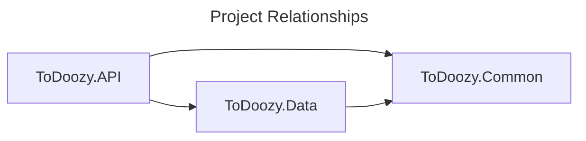

## Design

### Data Structures

#### ToDo record

|**Field**|**Type**|**Description**|**Required**|
|--|--|--|--|
|id|Integer|Unique, service-assigned identifier, non-secret|Yes|
|title|Unicode String|Short free text describing the ToDo, max 256 characters|Yes|
|description|Unicode String|Longer free text describing the ToDo in more detail, max 2048 characters|No|
|status|Integer|Represents enum, one of: "Not Started", "In Progress", "Completed", or "Abandoned"|Yes|
|ownerId|Unicode String|Foreign key referring to user that owns the record|Yes|
|createdAt|Integer Timestamp|Creation time as Unix epoch timestamp|Yes|
|updatedAt|Integer Timestamp|Last updated time as Unix epoch timestamp|Yes|

#### User record

We will use the ASP.NET Identity `IdentityUser` type with an integer primary key. This type pre-defines fields like `id`, `email`, `password`, and integrates seamlessly with default Identity APIs and services.

## Backend API Shapes

*Note: All HTTP requests will redirect to HTTPS with a 308 response code.*

### [POST] /register

Create user API, ASP.NET Identity default API.

Request body:
```
{
    email: <email>,
    password: <password>
}
```

Responses:
- `200` -> Success
- `400` -> Bad Request/Email In-use
- `500` -> Internal Server Error

### [POST] /login

Login API, ASP.NET Identity default API.

Request body:
```
{
    email: <email>,
    password: <password>
}
```

Responses:
- `200` -> Success
- `400` -> Bad Request/Email Not Found/Password Mismatch
- `500` -> Internal Server Error

Success response body:
```
{
    TokenType: "Bearer",
    AccessToken: <Token>,
    ExpiresIn: <TimeoutSeconds>,
    RefreshToken: <Token>
}
```

### [POST] /refresh

Refresh token API, ASP.NET default API.

Request body:
```
{
    RefreshToken: <token>
}
```

Responses:
- `200` -> Success
- `400` -> Bad Request
- `500` -> Internal Server Error

Success response body:
```
{
    TokenType: "Bearer",
    AccessToken: <Token>,
    ExpiresIn: <TimeoutSeconds>,
    RefreshToken: <Token>
}
```

### [GET] /todo

List API for ToDo resources, returns partial information about records, simple pagination and status-based filtering. Returns partial records.

Query parameters:
- `page`
- `limit`
- `q`
- `status`

Responses:
- `200` -> Success
- `400` -> Bad Request
- `401` -> Unauthorized
- `500` -> Internal Server Error

Success response body:
```
{
    todos: {
        {
            id: <identifier>,
            title: <title>,
            status: <status>
        },
        ...
    }
}
```

### [GET] /todo/{id}

Get API for ToDo resources, retrieves information about a single ToDo. Returns full record for developer convenience.

Responses:
- `200` -> Success
- `400` -> Bad Request
- `401` -> Unauthorized
- `404` -> Not found
- `500` -> Internal Server Error

Success response body:
```
{
    id: <identifier>,
    title: <title>,
    description: <description>,
    status: <status>,
    ownerId: <identifier>,
    createdAt: <createdAt>,
    updatedAt: <updatedAt>
}
```

### [POST] /todo

Post API for ToDo resources, creates a new ToDo. Returns full record for developer convenience.

Request body:
```
{
    title: <title>
    description: <description>
}
```

Responses:
- `200` -> Success
- `400` -> Bad Request
- `401` -> Unauthorized
- `500` -> Internal Server Error

Success response body:
```
{
    id: <identifier>,
    title: <title>,
    description: <description>,
    status: <status>,
    ownerId: <identifier>,
    createdAt: <createdAt>,
    updatedAt: <updatedAt>
}
```

### [PATCH] /todo/{id}

Patch API for ToDo resources, updates content of an existing ToDo record. Returns the full updated record for developer convenience.

Request body:
```
{
    title: <title>
    description: <description>
    status: <status>
}
```

Responses:
- `200` -> Success
- `400` -> Bad Request
- `401` -> Unauthorized
- `404` -> Not found
- `500` -> Internal Server Error

Success response body:
```
{
    id: <identifier>,
    title: <title>,
    description: <description>,
    status: <status>,
    ownerId: <identifier>,
    createdAt: <createdAt>,
    updatedAt: <updatedAt>
}
```

### [DELETE] /todo/{id}

Delete API for ToDo resources, deletes the record permanently.

Responses:
- `200` -> Success
- `400` -> Bad Request
- `401` -> Unauthorized
- `404` -> Not found
- `500` -> Internal Server Error

### Frontend

Framework: Vue

General concept:
- Single main page with a list view, including paging controls and status filters
- List view items will simple icon-based status controls and clickable title to view/edit the entry
- A button to the top-right of the table will be used to create new ToDos
- Create/Edit/View forms will all be surfaced as modals over the singular list view page
- Login/create user will be one unified flow, also surfaced as a modal
- Auth bearer token refresh will be handled in the background 

### Backend Details

Framework: `ASP.NET`
Solution Name: `ToDoozy`
Projects:
- `ToDoozy.API` -> API Handlers, Middlewares, Web Server, DTOs, Validators
- `ToDoozy.Common` -> Constants, Enums, Utils, Common Models
- `ToDoozy.Data` -> DB Context, DB Models (Entities)



*Note: For a larger application you may want a Core/Services project between Data and API projects, but that's overkill for a simple CRUD app like this.*

Our APIs will use DTOs that decouple API shapes from the internal database model representations (Entities). AutoMapper is commonly used to map between such types, but this is overkill for us.

Expected middlewares:
- Exception handling (catch, log, return 500)
- HTTP -> HTTPS redirection
- Routing (ensure requests go to the right handlers)
- Authorization (ensure users are authorized)
